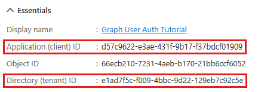
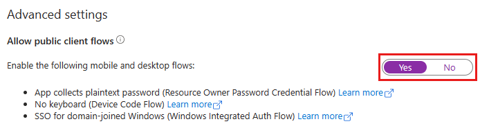

# Microsoft Graph .NET Client Library For Mail

The Microsoft Graph .NET Mail Client Library targets .Net 6.0.

Integrate the [Microsoft Graph API](https://graph.microsoft.com) into your .NET project!
## Installation via NuGet

To install the client library via NuGet:

* Search for `MSGraph.Mail.Client` in the NuGet Library, or
* Type `Install-Package MSGraph.Mail.Client` into the Package Manager Console.

## Getting started

### 1. Register your application

1. Open a browser and navigate to the [Microsoft Entra admin center] (https://entra.microsoft.com/) and login using a Work or School Account.

2. Register your application to use Microsoft Graph API using the [Microsoft Application Registration Portal](https://aka.ms/appregistrations).

3. Select New registration. Enter a name for your application

4. Set Supported account types as desired.

5. if you want to setup your application as a background service then leave Redirect URI empty else if you want to set it up as a delegate (sign in) user add **http://localhost**

6. Select Register. On the application's Overview page, copy the value of the Application (client) ID and save it, you will need it in the next step. If you chose Accounts in this organizational directory only for Supported account types, also copy the Directory (tenant) ID and save it.



**Note: If you want to use it for your personal email account like outlook.com or live.in use tenantId as a **consumer****

7. Select Authentication under Manage. Locate the Advanced settings section and change the Allow public client flows toggle to Yes, then choose Save.


### 2. Create a Microsoft Graph mail client object with an authentication provider

 * Interactive Flow
    ```c#
    Settings settings = new();
    settings.ClientId = "";
    settings.TenantId = "";
    //We need to pass the scopes which we require and the same has been set at the API Permission in the Azure
    settings.GraphUserScopes = new string[] {
      "openid",
      "profile",
      "offline_access",
      "user.read",
      "mail.readbasic",
      "mail.read",
      "mail.send"
    };

    IAuthenticationProvider authenticationProvider = new AuthenticationInteractiveProvider(settings);
    ```
 * Daemon or Client Secret Flow
```c#
    Settings settings = new();
    settings.ClientId = "";
    settings.TenantId = "";
    settings.SecretId = "";

    // we set the scope only in the API permission level in Azure.
    IAuthenticationProvider authenticationProvider = new AuthenticationClientSecretProvider(settings);
```

### 4. Make requests to the graph mail

Once you have completed authentication, you can
begin to make calls to the Email Graph service. The requests in the SDK follow the format of the Microsoft Graph Mail API's RESTful syntax.

```c#
IEmailGraphService emailGraphService = new EmailGraphService(authenticationProvider);
```
### 5. Read and Send Emails

IEmailGraphService Service has three different APIs:
 * Task<IList<EmailMessage>> GetEmailsAsync(int top = 10, int limit = 10, EmailRequestParameterInformation? requestInformation = null, bool markRead = false);
    * top: Set top parameter to the value to fetch only that much emails. By default it will fetch only top 10 emails in descending order by receivedDateTime.
    * limit: limit to fetch the emails. Set limit to -1 to get all the emails.
    * requestionInformation: This will help to set the $filter, $search, order by given fields and set the flag to include attachments with email.
* public Task<IList<EmailFileAttachment>> GetEmailAttachments(string? messageId);
    * messageId: Email Message Id recieved from the Graph API
 * Task SendEmail(EmailMessage emailMessage); 
   * emailMessage: Message object.

   Note: Please check the EmailDemoApp for the details examples: